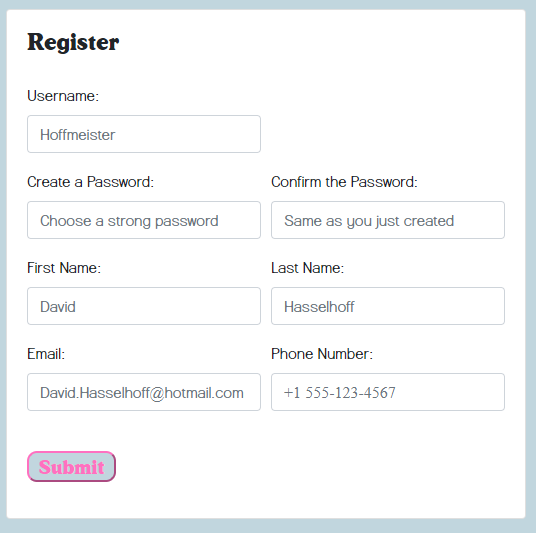
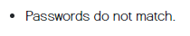
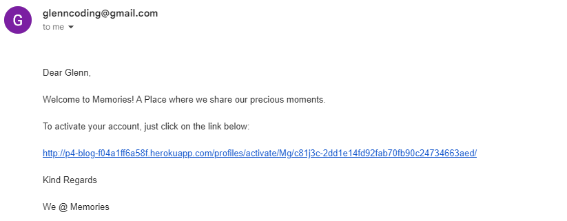
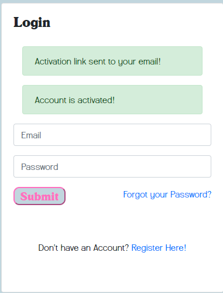
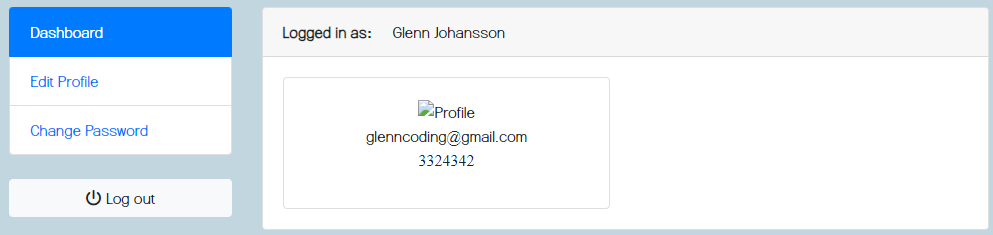

# Memories

### Overview

This is a Python/Django based project. 

### Features

1. **User Registration:**
   Users register adding their username, first/last - name, email, phonenumber and password. Password needs to be typed in two times.
   

   If Passwords dont match, or the user choosing a used username alert messages will show.
   
   If The registration is a success a success message will show and a verification email will be sent to the provided email.
   
   
   Here the User needs to click on the verfication link to verify their account.
   
   
   When pressing the link it will also redirect them to the login page where they need to enter their username and password.
   
   
   Exactly as the registration process if the username or password is invalid an error message will show and a success message if the details are correct. When logged in the user will be greated with a wellcome message followed by their username in the navbar.
   
   
   When logged in the first page the user will see is their own dashboard. 
   

2. **Dashboard**
    
   Here they will see whom they are logged in as (username). They can see their , not uploaded profile picture aswell as their email and phonenumber beneath. To add a profile picture the user needs to click on the "Edit Profile" button in the leftside menu: 

   * "3.2 Dashboard"
   * "3.1 Edit Profile"
   * "3.3 Reset Password"

2. **Navbar**
   - The navbar is located on all pages. Within the profile pic button there is a dropdown menu where the user can login/logout or access -      their dashboard. Here is also a messages link where the user will see pvp messages in a later stage.
   - The Brand is also a button which takes the user to the Postwall whenever clicked.
   - There is also a search function and a friends dropdown list which will be functioning in a later stage.
     
3. 

     3.1 **Edit Profle**
     Here the user can change all their details and also add their profile picture, which will show in the navbar + in the profile class in      the django admin interface. Phonenumber is also optional to provide.

     3.2 **Dashboard**
     Here the user will see their enlarged profile picture aswell as their phonenumber

     3.3 **Reset Password**
     If the user wants to  change password he/she must type his current one and then the new passwords 2 times. Error/success message will       show if it didnt work/worked.

5. **Login**
   If the user forgets his/hers password there is a link where the user can provide their email address to create a new one. Just like the     registration process.
   If the user dont have an account he/she can register through the link shown here.
   
6. **Logout**
   When the user has logged out a success message will show and the profile picture is removed and instead of wellcome (username) it is now    wellcome Guest! shown in the navbar. 
     
4. **Homepage/PostWall:**
   - The homepage displays all posts in descending order of creation.
   - Each post includes details such as title, content, author, and creation date.
   - Beneath each posts are all the users username followed by their comments in descending order
     
5. **Post_details**
   - To comment on a post there is a "add comment" button beneath each posts which will take you to the "post_details.html"
   - Here the user can add their comments by writing in the text field and submit it through the submit button.
   - Users can delete their own posts and their comments using the delete buttons next to them within the post_detail page.
   - Admins however can delete all posts and comments and not just their own.
   

6. **Authentication and Authorization:**
    - Certain views are protected with the `@login_required` decorator, ensuring only authenticated users can access them.
    - Authorization checks are implemented, such as verifying that the logged-in user owns a post before allowing deletion.

### Style ###
As always I have a tendency to get stuck where the most fun is. Something I´ve learned due to all project resubmissions is that first make the backend work and then the frontend. Due to changes of the backend always ends with the style needing to be changed aswell making all the hours spend on style just a waste of time (even though its fun) 

### Testing

Ive done numerous testing on both this and my first 4 project submission "Memories" and "Memories1" which also are puplic here on github. 
Ive also taken alot of the work from P5 and implemented here in p4. In otherwords please check those repos aswell to see the tests ive done. 

I´ve used Visual Studios extensions for Flake8/pep8 tests and no errors. 
I´ve check all pages in various views (smartphone/Ipad/4k/1080p/1440p)

### Agile
I´ve Used AGILE when estimating what work must/should/could be done. 

## Credits
- Code Institue lessons
- Facebook
- Pythontutor.com
- Django official homepage
- Django Forum
- Upwork.com
- UDEMY
- FREE LOGO Maker
- FontSpace
- Temp Mail

### Deployment

God, I hope I really can make it work this time. 

### Notes:

* Wish I could have fixed the search function, the pvp messaging, the friends dropdown button and the profile picture button nicer looking when in guest mode.
* Overall I´m happy with my work even though with out mentor support. 
  

### Developer
Glenn Johansson
